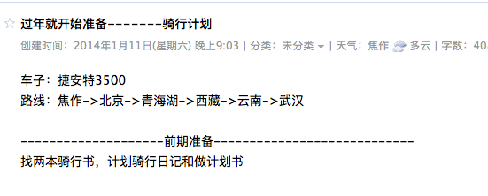

## 背景音乐－－－－青春无悔，老狼版

### 毕业一年小结。。。说好的战斗呢？
> 仅以此文献给新浪数据系统服务平台一起“战斗”过的战友。@海潮 @启盼 @大闪 @栋哥 @樊亮 @波哥等。。。

2015年7月3号是自己工作整一年的日子。一直也很想写一篇文章，对这一年做一下总结。这篇文章在7月3号左右的时候是已经写出来了的，但是自己在反复读了几遍以后感觉写的不是很好，就想着要再修改修改。
之后就是在团队里面因为一个紧急的项目，忙忙碌碌了好几周，记得这个过程中有两个周末还需要到公司加班，甚至到了凌晨2-3点左右才回家。哈哈，不过也算是毕业以后经历了一段难忘的岁月。这里开个不恰当的玩笑就是“有产品经理的项目对程序猿来说真的是一个不怎么好过的项目啊”。
下周就是要反法西斯放假了，而自己也将要迎来一个11天的小长假。而且自己也已经计划好了去哪里，要做些什么，抱着什么样的心态去做。其实我是不知道自己到那里能不能坚持下来的，而且至从定了这事，每天只要是有空的时候，自己心里面的两个自己都在做斗争“不要去了，不去了还可以省钱，好好的在家睡觉看电影多爽”，“而另外一个自己却说，你已经推迟一年了，如果这次还不能下定决心，那你以后也只能将就的生活了，趁年轻，给青春留点回忆。。。”
---- 
对于“编码”之外，要想让自己集中精力来写一篇文章什么真的是一件非常难熬的一件事情。虽然自己有每年写年终总结的习惯，但是对于写文字来说真的是件痛苦的事情。就好比有些事情，有些人是因为热爱去做，有些人是因为不得不做。
#### ***1.*** 青春不散场，对梦想不妥协
写到这个标题的时候，自己都是一愣一愣的。早都不是学生了还谈什么青春，还谈什么梦想。上面也已经提到了，自己下周将要去做一件事情。这也是自己给自己这次旅行想的一个口号。
自己确实事给自己定过太多的计划，和有过太多的梦想。虽然大多数都夭折了，连自己都不记得了。但是有件事自己还是一只都记得，而且记在了自己的QQ邮箱的记事本里面
记的14年1月份那个时候，还没毕业，自己都开始计划，一些自己毕业后要做的事情。记的那个时候自己还做了一个计划，美其名曰：“人生计划”。

当然还不止这些

当我从自己的QQ邮箱的记事本里找到自己写的这些东西，打开看的时候自己都笑了，那个时候是要去骑行川臧线的，但是最后一个夜市没有实现的。
前段时间在QQ空间，微博上看到各种毕业生的毕业照。不禁想起去年自己毕业拍毕业照的光景。我是真想在这里贴一张那时的照片的，我也想晒一晒，但是当我翻看完所有那时拍的照片，还是放弃了自己的这个想法。因为极度不相称的衣服戴上学士帽的我显的极度的不和谐。。。不过还好，自己这一年还是收获很多的。
#### ***1***.What?运维工程师？
毕业前自己主要学习的是C#，实习的时候也做过专职的前端工程师。本来毕业的时候想要做的是java工程师，不过毕业后阴差阳错的做了运维工程师。先谈谈一个合格的初级运维工程师应该掌握哪些技能吧。首先Linux是必须了解熟练的，然后就是shell。然后接下来开始细分，比如说，mysql 运维工程师（也可以说是DBA，两者是不分家的），然后有系统运维工程师，非关系型数据库运维工程师（比如redis）等，根据每个职位的不同，需要掌握不同专业的技能。
而我就是做了非关系性数据库工程师。这个职位跟我之前学习的技能和知识是有很大差距的。比如说Linux，当然现在纯运维工程师已经很难满足市场的需求，运维开发工程师相对来说更是市场的发展方向。所以之后，自己又学习了python。
直到今年的6月份自己一直是一个运维工程师，直到后来有个机会自己去做了前端工程师。
对于我个人来说，我是非常感谢这段经历的。作为一个在大学对Linux根本就没怎么接触过的人，从最初的排斥，慢慢的了解，然后接受，最后喜爱。这段过程是值得纪念的。
对于python这门语言，由最初的了解，到熟悉，然后喜爱，这段过程。虽然python不是世界上最好的编程语言，但他绝对是世界上最好用，好学，功能强大的语言。
#### ***2***有些事总要有人去做，有些事情总要去经历
记得那个时候已经是14年的11-12月份了吧，那个时候@启盼 还没有离职，下班的时候经常和@启盼一起吃饭，然后一起到公车站坐车回家。
@启盼是一个少数民族，来自新疆，那段时间@启盼给我讲了很多他自己经历的真实的新疆生活。对于没有经历过那样生活的人来说，听到那样的事情还是很难以置信的。其实作为团队里仅有的两个应届毕业生之一，除了平实要完成工作上的事情还是有很多其它的事情要去的做的，记得那个时候每周都要组织团队成员进行内部分享，还有就是组织大家一起参加一些活动，比如说，周末一起去奥森公园去打打球你，我自己经历的事情是，组织大家去奥森公园和去沙河水库烧烤。
那段时间，自己确实是做了很多的杂事，有时候自己内心还是会有些小情绪。但是最后想想自己做的那些事情还是有很多的收获的。
不管事大事小，只要自己去做了都是在考验自己的性格和耐心。记得那个时候，自己组织的活动并不是很好，谢谢老板@海潮 的用心批评，使我在错误的道路上能够纠正到正确的道路上来，并且学习了很多经验。
#### ***2.*** **月薪10k和20k是一种怎样的人生体验**
最重要的事情是经济独立，又经济独立想到的。
这两个话题是前几天在知乎上看到的。《[*什么样的人一毕业就月薪 1 万以上？*](http://www.zhihu.com/question/27996596 "知乎")》和《[*月薪 2 万元是一种怎样的人生体验？*](http://www.zhihu.com/question/27705220)》
作为一个一毕业月薪过10K的人，我很想谈一下这两个话题。其实对于应届学计算机能拿到10k之上的offer还是很正常的。

其实最大的好处就是经济自由，可以去做自己想要做或者说事喜欢的事情。比如说当自己觉得当自己面对3个显示器的时候的工作效率是最高的。

前端时间自己新组装的电脑

跟学妹聊到的“大学事最不需要怎么花钱的年纪，还去给别人当小三”、
欲望跟自己的能力有差距的时候，当自己不能够控制的时候，就会去找其它的能够满足自己的欲望的外力

#### ***3.*** **责任是什么？**

几次事故,事故原因

前几天跟学长在群里偶然谈到了责任这个话题。有人说：”40岁的时候应该懂的责任这个词“。其实我是极度的不赞成的，”我反问到40岁不晚么？“我觉得人成年以后就应该懂得这个词的分量了，首先应该懂的对自己的负责，才可能懂的对朋友和对家人负责。

回想自己的从小到大总感觉是不舒服的，总是做一些自己所不喜欢的事情，所以我曾经对自己说过，将来我如果有孩子了，坑定让他选择他自己喜欢的生活。而且，我竟然一直以为这是对的。
也是前段时间跟一个同学聊天，偶然谈到这个话题，她说道：”…当孩子还仅仅是孩子的时候，他可能不会选择，或者说这么去做的意义的时候，作为大人应该去替他选择“。之后几天我都一直在思考这个问题，回想自己小时候被家长”逼着“去做自己不喜欢的事情，其实现在想想也能够理解和释然了，站在他们的角度来说，那样做肯定是对的，而恰恰对自己来说，自己当时是无法理解的。

##### **突然想到了教父里面的一段话：**

> **第一步要努力实现自我价值；第二步要全力照顾好家人；第三步要尽可能帮助善良的人；第四步为族群发声；第五步为国家争荣誉。事实上作为男人，前两步成功，人生已算得上圆满，做到第三步堪称伟大，而随意颠倒次序的那些人，一般不值得信任。**
其实第一条已经很清楚的说名我们首先应该对自己的负责，让自己变得优秀后才有可能有能力去照顾好自己的家人。

### ***4.*** **我喜欢做事情要讲就效率**
平时我很喜欢当我做错事情的时候，别人能够直接指出我的错误，我不用去花心思去想我到底哪一点错了。你只需要指出本质就可以了。

不知道从什么时候自己发现，自己的脑袋不够用了，没有之前好使了。每次想要做什么事情的时候，可能下秒就会突然忘记自己要做什么来这，所以很多时候，自己每次要到做什么事情的时候，都是立刻拿出手机记录到备忘录里去。
有时候会怀疑自己是不是变笨了，可能随着年龄的增长，需要自己去操心的事情多了。

### ***5.*** **怎么做一个优秀的员工**
@海朝 和 @栋哥 在工作上都交了我很多
1.要做好每一件交给自己的小事
2.不管是小事还是大事都要及时向领导恢复工作的进度。如果遇到意外的情况更要给两道说明情况。及时跟领导沟通进展。如果是领导主动问，这时候作为员工的自己已经输了，到时候是意外的情况也可能会变成借口。
3.如果工作完成，应该及时的跟领导说明自己的计划，和对之后项目的规划。其实在这个工作中也是和领导做好关系的机会。才可以让领导放心。

不要先提出自己的需求，先做好自己的事情。

> 专注产生勇气, 发散产生智慧, 学习产生力量

### ***6.*** **女孩子比男孩子优秀那又有什么问题？**
已经记不清在哪看到的这个话题了。但是平时生活中还有看过的电视剧中，很多场景都出现过，在家庭生活中女孩子比男子优秀容易出现家庭矛盾的场景。谁有能力就多承担一些呗。
其实按照我现在的看法是我不会去在乎谁在家庭中的地位谁高谁底的问题，我觉得只要两个人都是足够的优秀才会有更多的时间和经历投身到家庭的建设当中去。
甚至我觉得一个在双方的生活中需要女方去做决定的，我觉得也是不合格的。

> **一个成功男人永远不会嫌弃自己女人太优秀，除非他驾驭不了！就像一个女人永远不会嫌弃一件衣服太漂亮，除非她穿不上或买不起！**

### ***7.*** **别因为自己的问题让你跟别人迁就你**
我有一个女同事，每次因为工作她跟别人发生矛盾的时候，都会说自己的脾气就是这个样子的。凡是说这句话的时候，都是让别人来迁就自己，”但是为什么自己不好好想想别人为什么要迁就你呢？“
我觉得最重要的是要做好自己的事情。
前几天看到什么是好女孩的一句话，大致是，“很多女孩子可以利用自己是女孩子的身份，去做成很多事情，但是很多女孩不把自己当女孩子而是，作为一个正常人去做事情。前者是女孩，而后者是好女孩儿。”

### ***8.*** **“好人“一直都在自己身边**
一直觉得是自己运气好，不管

一直觉得是自己运气好，每到一个地方都能遇到很厉害，和很好的人。最后一天自己发现，可能不是自己运气好，而是老厉害的人喝好人比较多而已

### ***9.*** 感恩有你们的这一年
在这里很感谢初毕业就能加入新浪数据系统服务平台这个优秀的团队。在其中遇见的领导**@杨海潮 **，组长**@启盼**，**@大闪**，**@蕃亮**，**@曾涛**，还有**@栋哥**，谢谢你们这一年所教会我的。你们在我毕业的这一年给我不仅仅是工作还有思想和生活的指导使我一生收益。

一个17人得团队最后只剩下6个人。最后自己几乎送走了以上的所有人。

应届毕业生做很多的杂活并不是没有好处。累一些总是好的，可以学到很多的知识。自己在之前的团队也是需要做什么就做什么，当然很多时候自己做的都不是很好，但是犯错也是一种学习，而且能够学到的更多。
还是想谢谢你们给我的指导。

### ***10.*** 做成一件事比做了很多事重要
其实对于过来年，团队这么大的变化，自己也考虑过要换一份工作，但是自己回想现在还有很多的事情要做。还可以做很多有意义的事情。
其实我觉得我的日子也快要来了。新浪作为自己的第一家公司还是很有感情的。
”当自己是菜鸟时，是新浪接纳了你，当你变成大牛时，是新浪培养了你“。不管是将来还是以后我都不会忘记这句话。

拿栋哥做例子来说明这个话题

#### 培养自己的性格和爱好

摄影

今年三月份的时候，自己在备份自己电脑的时候，不小心，丢失了一些照片，之后自己因为工作原因就很少出去拍照了

#### 一个老生常谈的话题
前几天看了老罗的“坚果”手机发布会，有很多感触。从老罗身上可以明显看出他和“商业巨子”雷军，还有新秀“刘作虎”做手机的风格完全不一样地方。雷军是个地地道道的企业家，刘作虎追求的是对品味的把玩，但是在老罗身上可以看到一个踏踏实实做产品，一切为用户的企业家。先不说老罗开了几次发布会，捐了几次门票是炒作还是作秀，但是这些钱真的是捐出去了，而且也帮到了很多人。
就像很多人在网络上议论的，对于现在很多处于80后尾巴，90后甚至是00后们来说，它们并不知道老罗为甚么砸了冰箱，怎么在新东方教的英语，但是它们确确实实是开始喜欢上了老罗。
是的，我也是属于这拨人中的一个，其实我对老罗了解的不多，但是我已经喜欢上这个总是能够带给我正能量的“胖子”了。
现在的生活和工作中，负能量很多，有时候自己也会成为一个负能量的散播者，所以还是很需要这种精神的。
对于工作，对于工作的态度

#### 什么样的团队是一个优秀的团队
关于带领团队的一些思考和招人的一些事情
关于少抱怨“一个同事的例子”。

#### 自身问题的一些反省
关于自己做事情拖延的事情
对雨同事关系的处理
自己情绪的控制

对于工作中遇到繁杂的工作的处理的情况

怎么样使自己的工作能够井井有条的

最重要的是要对自己做的工作能够保持热情这样才可以能够把工作做好

### ***9.*** 最后宣传栋哥的github地址

---- 
**生活从来不容易 。当你觉得容易的时候，肯定是有人在替你承担属于你的那份不容易。**最后原谅我在书上看到的鸡汤太多。。。这些纯属饭后谈资而已。。。

