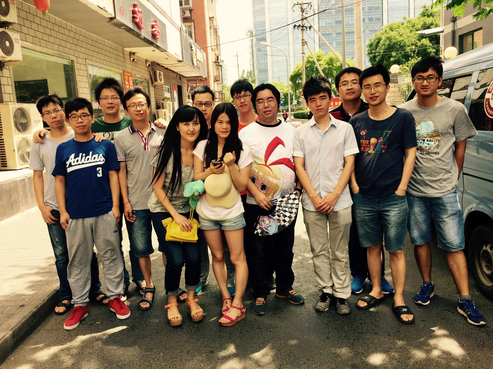
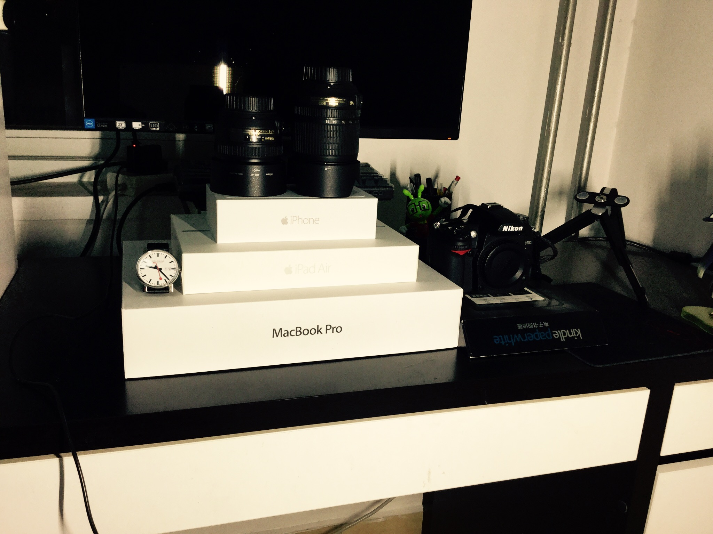
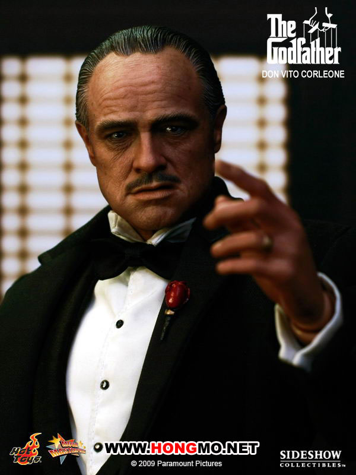
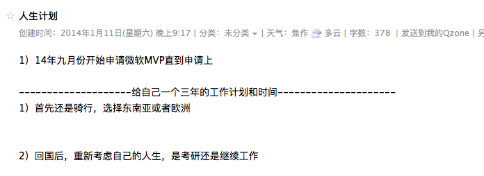

### 毕业一年小结...说好的战斗呢？
[TOC]
####引子：
2015年7月3号是自己工作整一年的日子。一直想写一篇文章，对这一年做一下总结。这篇文章在今年7月3号左右的时候是已经写出来了的，但是自己在反复读了几遍以后感觉写的不是怎么的好，就想着要再修改修改。

之后就是在团队里面因为一个紧急的项目，忙忙碌碌了好几周，记得这个过程中有两个周末还需要到公司加班，甚至到了凌晨2-3点左右才回家。哈哈，不过也算是毕业以后经历了一段难忘苦逼的日子。这里开个不恰当的玩笑就是**“有产品经理的项目对程序猿来说真的是一个考验生理和心理的一个过程啊”**。

下周就是全国反法西斯放假了，虽然说是全国人民都应该纪念和庆贺的日子，但是好像还是跟自己关系不是很大。自己也将要迎来一个11天的小长假。当然自己也已经计划好了去哪里，要做些什么，抱着什么样的心态去做。其实我是不知道自己到那里能不能坚持下来的，而且自从定了这事，每天只要是有空的时候，心里面都会有两个自己在做斗争**“不要去了，不去了还可以省钱，好好的在家睡觉看电影多爽”**，而另外一个自己却说，**“你已经推迟一年了，如果这次还不能下定决心，那你以后也只能这样的将就了，趁年轻，去吧，给青春留点回忆。。。”**

对于*“编码”*之外，要想让自己集中精力来做一件事情有时候是一件非常难熬(甚至是十分困难)的事情。虽然自己一直都有写博客的习惯，但是对于写文字来说还真是件痛苦的事情。就好比有些事情，有些人是因为热爱去做，有些人是因为不得不做而去做。

----
####***1.*** **What?运维工程师？**
大学毕业前自己乱七八糟的学了很多种技术，实习的时候也做过专职的前端工程师，反正是跟运维工程师是没有半毛钱关系的。而自己毕业后也想要做的是java工程师，但是毕业后却阴差阳错的做了*运维工程师*。

先谈谈一个合格的初级运维工程师应该掌握哪些技能吧。首先Linux系统知识是必须了解熟练的，然后就是shell。然后按照职位的不同开始细分，比如说，**mysql 运维工程师**（也可以说是DBA，两者是不分家的），**系统运维工程师**，**非关系型数据库运维工程师**（*比如redis*）等(*反正有很多种，我一个巴掌数不过来的*)，根据每个职位的不同，需要掌握不同专业的技能。而我就是做了非关系性数据库运维工程师。这个职位需要掌握的技能和知识跟我实际会的技能是有很大差距的。比如说`Linux`，`Redis`,`MemCached`,`python`,这些大学听都没听过的东西,“老大，请问这是什么东东，做这些干什么？”。

当然自己也没傻到真的这样去问老大，不管了解不了解，慢慢的学习吧。按照市场的需求，现在纯运维工程师已经很难满足市场的需求了，运维开发工程师这个职位对于小，中，大公司都是很抢手的，更是市场的发展方向。所以学习python是必须的。

这一年中自己都在跟着**@大闪** **@樊亮** 开发新浪的自动化运维平台。刚开始还是遇到很多困难的，不过还是那句话**“困难面前，只要你自己不先放弃，或者是妥协，最终都是能够克服的！”**,所以喽，最后反正也对什么都算是熟悉的程度了。

对于我个人来说，我是很不喜欢运维这项工作的，出了开发之外每天都是跟机器打交道，还有打电话跟业务打交道，有很多事情感觉做的很没有意义。所以，到今年6月份之前自己都是一个不怎么合格的运维工程师。但是我还是非常感谢这段经历的。虽然很多知识在我现在的工作中用不到，但是它们对我知识面的广度还是很有影响的。特别是Linux，全世界公认的开源的优秀的操作系统，在大学对它的了解几乎为**0**，也从最初的排斥，慢慢的了解，然后接受，最后喜爱(*怎么突然觉的有点儿恋爱的感觉啊*)。对于python这门编程语言也同样经历了这样一个过程。**python虽然不是世界上最好的编程语言，但他绝对是世界上最好用，好学，功能强大的语言。**然后呢？都这样了还要什么然后啊，好用就行了呗，而且关键点也是薪资水平也是行业内数一数二的。(偷笑中...)

上面道貌岸然的把自己称为***工程师***,感觉还是有点心虚的啊，其实我就是社会最底层的一个还有点梦想和理想的**小码农**而已!
>**生活就是这样，不是任何时候，都有机会去做自己喜欢做的事情，应该从当下应该做的事情中，发现自己的兴趣点儿，不要刻意的去排斥，到最后都会有不一样的收获。**

**14届新员工集训**

####***2.*** **某个阶段总要去经历，某些事总要有人去做**
作为团队里仅有的两个应届毕业生之一，有时候还是需要做除了工作之外的一些其它的事情。第一件，组织TEAM的每周分享，工作包括：前期联系分享人，发通知邮件，预定会议室。第二件就是组织大家进行一些工作之外的活动。比如说,周末组织大家一起去奥森公园跑跑步，打打球什么的。

那个时候每周都要组织团队成员进行内部分享，，分享人有自己TEAM内部的，有从其它TEAM邀请的。这些分享大多数时候都能让人了解很多自己工作之外的知识，也能够了解其它部门同事在做什么工作。另外就是组织大家一起出去活动，比如一起去奥森公园打球，一起去沙河水库烧烤等，这些活动都能够很好的让TEAM同事之间交流感情。

虽然都是一些小事和杂事，但是却需要组织者在前期去做很多工作的。那段时间自己内心也会有些小情绪，比如说：*“＊＊，为什么要做这些事情”*。其实这些都不是最重要的，**最重要的是你很难做到每个人对你的组织或者说付出都满意**。但是最后想想做这些事情还是有很多的收获的，想把这些事情做好需要一个有耐心的人，而且也需要一个好的心态来面对来自他人的质疑。对于我来说，很多事情是没有做好的，第一方面自己缺乏组织活动的经验，第二就是自己耐心不足。记得在自己犯错误或者有事情做的不够好的时候，谢谢老板@海潮 的用心批评和建议(学习了很多管理经验)，把我从错误的道路上拉回来，并且教我**怎么去做事儿，怎么把事儿做好**。

记得那个时候已经是14年的11-12月份了吧，那个时候@启盼还没有离职，下班的时候经常和@启盼一起吃饭，然后一起到公车站坐车回家。所以也和@启盼经常交流，**“有些阶段每个人都要去经历，有些事情总要有人去做，当你不得不去做某件事情的时候，你应该考虑已经不应该是愿不愿意做这件事，而是怎么把这件事做好。”**。
@启盼是一个少数民族，来自新疆，那段时间@启盼 也给我讲了很多他自己经历的真实的新疆生活。对于没有经历过那样生活的人来说，听到那样的事情还是很难以置信的,有种*xinjiang*人民生活在水深火热中的感觉。当然@启盼 也给我看了漂亮的新疆妹纸（不知道比我大的还能不能叫妹纸），过了年的时候在Facebook上看到@启盼 已经和青梅竹马的女友领证了，这里只能默默的送上一个祝福了。

**那个时候大部分人都还在，不过有些人已经算TEAM新员工了**

####***3.*** **月薪10k和20k是一种怎样的人生体验**
这个是前段时间在知乎上看到的两个话题。**《[*什么样的人一毕业就月薪 1 万以上？*](http://www.zhihu.com/question/27996596 "知乎")》**和**《[*月薪 2 万元是一种怎样的人生体验？*](http://www.zhihu.com/question/27705220)》**。看了大家的答案，讨论(也可以是争论)的还是很火热的。可能有很多应届大学毕业工资水平没有过10k这个水平的学生，想要知道什么毕业生可以拿到这个薪资水平。还有一部分人，就是工资水平处于10k-20K之间，想要知道别人是怎么突破20k这个临界值的。

其实我也不是一个很厉害的人，但是我还是想谈谈自己对这个话题的看法，和背后所隐藏的意义。应届毕业能够拿到10k以上月薪的基本上都是进入国内一线或者二线的互联网公司的吧。但是对于这些公司来说，这个薪资水平也是最基本的起薪而已，所以没什么好谈的(*就跟体制内和体制外的生活一样，各有各样的烦恼，也各有各样的好*)。

我想说说，这背后所隐藏的一些潜在的问题吧。最起码这群人应该算是一群聪明的人，一群“聪明”的人在一起工作，效率肯定会高很多。第二就是对一个人视野的提升，比如说我之前的运维部门，我们TEAM全盛时期17个人，运维线上3k多台服务器，如果在小公司，一个十几台的服务器就敢称*“集群”*，可能连自己的服务主机都没有，但是这样的公司还敢说自己在搞什么*大数据*。试想一下，十几个人，运维这么多服务器，那么多业务，怎么管理都是一件很复杂的事情，更不要说去处理和排查故障了。**恰恰在IT行业，一个优秀的架构师是应该具有很深的技术功底和广阔的视野的。技术功底自己可以培养和苦练，但是视野，是小公司永远给不了的。**,当然还有很多...

好吧，好吧，不谈这么沉重的话题了。接下来我是来“炫富”的(求乱棍不要打死...)。
当然一个应届毕业生可以拿到这样的薪资的时候，说明自己可以绝对的经济独立和自由了。然后就可以去做自己很多自己想要做和喜欢做的事情。

*这是毕业四个月后，除了了**单反**是大学时候买的，自己已经有能力买的起苹果三件套了*

*当自己觉得3个显示器在工作的时候效率才是最高的，可以有能力去尝试*

大学的时候自己都想组装一台自己的主机。第一是考验自己有没有这样的能力，第二就是台式机确实比笔记本的性能高啊。然后就是前段时间终于忍不住，自己在天猫买了零件装了一台。因为之前没有实际经验，就是装了拆，拆了装，慢慢的摸索，从开始到最后正常运行，大概花了6个小时左右吧(其实我还是很享受这个过程的...高兴ing...)

前段时间刚好跟学妹聊到一个话题。就是关于欲望的话题，*“大学的时候，是最不需要花很多钱的时候，但是还是有很多人为了钱去给别人当小三。”*
>**这种事情在现代社会是很正常和普遍的。人的欲望是无止尽的，当自己的能力满足不了当下自己的欲望和虚荣心的时候，欲望就会引诱着人们去堕落。So, *desire* is so fear !**

####***4.*** **你应该懂得什么是责任了**
自己在之前的岗位经历过新浪微博1次A级，两次B级运维故障。距自己经历的最近一次故障就是“陈赫离婚的长微博”。可能对于外行人，很难理解，一个计数器写满会引发那么大的故障。这里就不谈具体的原理和原因了，反正从那之后，微博上就在流传说，某个明星你再要发离婚帖或者结婚帖，出轨帖的时候先给我们**“渣浪”**(这个称呼是历史原因了，我们都这么自嘲)的运维工程师打个招呼，让我们提前预备资源，也最好别在半夜发，还得我们的工程师好不容易把老婆孩子都哄睡了的时候，正准备躺下,突然收到报警短信，又爬起来处理报警...

“zhiqiang 啊，咱们好像跑题了...  0.0”
一个好的运维工程师，绝对是一个有责任心的人。因为服务器的故障（包括：硬件和系统）的发生时间是不定，所以就需要工程师24小时待命。记得有次自己还在公交上，我直接领导打电话问我到家了没有，说有一台服务器的磁盘要被写满，马上就要挂了...(*这是一件很严重的问题*)。但是我还没有到家，刚好自己带了电脑。在一个面馆借着人家的WiFi给处理故障。(是不是觉得很苦逼...)

前几天跟学长在群里偶然谈到了责任这个话题。有人说：**“40岁的时候应该懂的责任这个词”**。其实我是极度的不赞成的，**“我反问到40岁不晚么？”**我觉得人成年以后就应该懂得这个词的分量了，首先应该懂的对自己的负责，才可能懂的对朋友和对家人负责。

回想自己的从小学到上大学之前的生活，总是被家长“强迫”做一些自己不喜欢的事儿(当然还是可以理解家长还是对孩子好的嘛)，所以我经常会对自己说，将来如果自己有了孩子，**肯定让他自己选择喜欢做的事情**。然而，我竟然一直以为这是对的。正好前段时间跟一个同学聊天，偶然谈到这个话题，她说道：**“…当孩子还仅仅是孩子的时候，他可能不会选择，可能他根本还没有辨是非的能力，或者说他根本就不知道做与不做意味着什么的时候，作为大人应该去替他选择”**。之后几天我都在反复思考这个问题，最后我自己也释然了，原来我一直都是错误的。替孩子去做选择也是大人应该为孩子承担的责任。

**突然想到了教父里面的一段话：**

> **第一步要努力实现自我价值；第二步要全力照顾好家人；第三步要尽可能帮助善良的人；第四步为族群发声；第五步为国家争荣誉。事实上作为男人，前两步成功，人生已算得上圆满，做到第三步堪称伟大，而随意颠倒次序的那些人，一般不值得信任。**
其实第一条已经很清楚的说名我们首先应该对自己的负责，让自己变得优秀后才有可能有能力去照顾好自己的家人。

**一起欣赏下，教父那睿智的眼神...**

####***5.*** **浅谈怎么成为一个优秀的员工**
**感谢@海朝 和 @栋哥 还有我的所有同事在工作中给我的宝贵建议，使我能够快速成长。**

在工作红有人肯直接指出你的错误是一件非常荣幸的事情(至少对于我来说是这个样子的...)。平时我很喜欢直接指出我错误人，也很乐意别人给我一些意见，这样就是我再也不用花费大量的时间和心思去想我到底哪一点错了。而我只需要关注问题的本质。

不知道从什么时候开始，觉的自己的脑袋不够用了，没之前好使了。每次想要做什么事情，可能下秒就会突然忘记自己要做什么了，所以很多时候，自己每到要做什么事儿的时候，都是干劲拿手机记录到备忘录里去。要不然很多能一会儿就给忘了。有时候会怀疑自己是不是变笨了或者是更年期了，更可能随着年龄的增长，需要自己去操心的事情多了。

好了，好了，赶紧谈正事吧，要不然下班又回不了家了...优秀的员工，你当然应该能够**做好小事和杂事**，然后**能够让领导及时了解工作的进度，遇到意外延期，更要及时上报(这个背后的意义，自己体会吧)**, 如果是让领导主动找你了解情况，按照@栋哥说的**“你已经输了！意外也可能变成了借口”**，最后是要**让领导知道自己对工作的计划**，这样他才知道你的时间是饱和的，没有闲着(公司不养闲人，机会也是留给有准备的人)。不管何时不要先提出自己的需求，你都应该先做好自己的事情。

####***6.*** **女孩子比男孩子优秀那又有什么问题？**
已经记不清在哪看到的这个话题了。*“很多男生都比较介意自己的女人比自己优秀”*。 我只想说，这样的事情为什么没有让我碰到？婚姻和家庭本来就是一个互补的过程，谁有能力就多承担一些那又有什么呢？为什么非要去在意谁承担的多一些或者少一些。
只有两个人足够的优秀才会有更多的时间和精力花费在家庭中去。如果每天都在为财米油盐争论不休，还谈什么幸福的家庭。

> **一个成功男人永远不会嫌弃自己女人太优秀，除非他驾驭不了！就像一个女人永远不会嫌弃一件衣服太漂亮，除非她穿不上或买不起！**

####***7.*** **别因为自己的问题让你跟别人迁就你**
我有一个女同事，每次因为工作她跟别人发生矛盾的时候，最后她也知道是自己的错。但是总会说是**自己的脾气不好，就是这个样子**来给自己找借口。我们再往深了去思考这个话题就是，平时生活中爱说这句话的人，都是想让别人来迁就自己罢了。但是？为什么别人平白无故的要迁就你呢？
看到过一段话，大致是，**“很多女孩子可以利用自己是女孩子的身份，去做成很多事情，但是很多女孩不把自己当女孩子而是当作普通人(不分性别)去做事情。前者是女孩，而后者是好女孩儿。”**

很久之前看到一篇**[《其实，你只是看起来很努力》](http://mp.weixin.qq.com/s?__biz=MjM5MjI3OTkzMA==&mid=203041961&idx=1&sn=bbc4c219c9bcf478c26e91a798ed9d44&scene=23&srcid=7cNmurpjvA4flyUDUs1k#rd)**的文章，对自己影响很大。自己也开始反思为什么高中的时候总是觉得自己很努力，但是总是考不好的问题。也终于能让自己释然一些，原来还是自己自身的问题。前几天又看到一篇**[《你不是太直，你只是自私》](https://mp.weixin.qq.com/s?__biz=MjM5MjI3OTkzMA==&mid=209499900&idx=1&sn=30884d7a7fe2ba5942f4e129dbf5f02b&scene=0&key=dffc561732c2265175bc0b8d91d9a66485d3c37b723e73bba682546e8d48e41ad46c4fd2d909a90d0020b86ebf9a6cbb&ascene=14&uin=MTUxNTExMjM1&devicetype=iPhone+OS8.4.1&version=16020411&nettype=WIFI&fontScale=119&pass_ticket=19DS%2FQ7HZOa3n3t%2FbYvIgXSP2iOUU5vvf97k7rgcfsI%3D)**的文章。这些文章写的都很好，能引导人从自身的问题去思考问题。往往读完后都能让自己的心里有种释然的感觉。

####***8.*** **“好人”一直都在自己身边**
>我一直觉得自己运气是非常好的，不管到哪里都能碰到谈的开的人，碰到很厉害的人，能够碰到肯帮助自己人。直到最近才想明白，不是自己运气好，只是好人本来就很多而已。

####***9.*** **感恩有你们的这一年**
在这里很感谢初毕业就能加入新浪数据系统服务平台这个优秀的团队。在其中遇见的领导**@海潮 **，**@启盼**，**@大闪**，**@蕃亮**，**@曾涛**，还有**@栋哥**等，谢谢你们这一年在工作和生活上给我的指导使我一生收益。

过年后，因为一些**“问题”**，@启盼先离职了，然后是老板@海潮，最后大家陆陆续续的都开始离职了，几乎上我送走了团队的每一个人。这个**问题**我现在还不能谈，第一我觉得我个人看的可能比较浅，第二就是会涉及到领导，和领导的领导。

####***10.*** **做成一件事比做了很多事重要**
谈谈一直都很佩服的@栋哥吧，我们团队的架构师。@栋哥的工作路线也很牛b，淘宝，大学老师，百度，渣浪。就像之前的TEAM年后变化还是挺大的，80%的老员工都离职了。但是@栋哥一直不见动静，而且一直在沉着心做事情。@栋哥在新浪做了很多有意义的事情，Redis版本开发，databus数据迁移系统(在github上开源后，大概两周就收到200多个star),还有一个给忘了...(智商捉急啊...)。其实也更@栋哥聊过有没有辞职换个工作的想法，@栋哥说:**“有是有，但是他想做的事情还没有做完，总不能做了一半就走吧”**。拿什么来形容@栋哥呢？其实@栋哥并**不是一个为了工作而工作的人，只是借助公司这个平台来实现自己的价值和梦想的人吧**。对于新浪这家公司，我也是有很多感情的，它是我毕业后的第一家公司，我已经不记得哪位同事说过的这句话了：
>**“当你还是菜鸟时候，是新浪接纳了你，当你变成大牛时，是新浪培养了你”**。

不管是什么时候我都不会忘记这句话。

####***11.*** **一个老生常谈的话题**
前几天看了老罗的“坚果”手机发布会，有很多感触。从老罗身上可以明显看出他和“商业巨子”雷军，还有新秀“刘作虎”做手机的风格完全不一样地方。雷军是个地地道道的企业家，刘作虎追求的是对品味的把玩，但是在老罗身上可以看到一个踏踏实实做产品，一切为用户的企业家。先不说老罗开了几次发布会，捐了几次门票是炒作还是作秀，但是这些钱真的是捐出去了，而且真真实实帮到了很多人。就像很多人在网络上议论的:
>对于现在很多处于80后尾巴，90后甚至是00后们来说，它们并不知道老罗为甚么砸了冰箱，怎么在新东方教的英语，但是它们确确实实是开始喜欢上了老罗。

是的，我也是属于这拨人中的一个，对于做手机前的老罗了解的不多，但是我也开始喜欢上这个总是能够带给我正能量的“胖子”了。现实生活和工作中，负能量很多，有时候自己也会成为一个负能量的散播者。对工作对生活要拥有这种积极向上的态度，还是很需要这种精神的感染的。

####***12.*** **青春不散场，对梦想不妥协**
写到这个标题的时候，自己都是一愣一愣的。早都不是学生了还谈什么青春，还谈什么梦想。上面也已经提到了，自己下周将要去做一件事情。这也是自己给自己这次旅行想的一个口号。
一路走来自己确实是定过太多计划，有过太多的梦想。大多数都夭折，连自己都不记得了。但是有件事自己还是一只都记得，而且一直记在自己的QQ邮箱的记事本里面
记的14年1月份那个时候，还没毕业，自己都开始计划，一些自己毕业后要做的事情。记的那个时候自己还做了一个计划，美其名曰：“人生计划”。

当然还不止这些 

当我从自己的QQ邮箱的记事本里找到自己写的这些东西，打开看的时候自己都笑了，那个时候是要去骑行川臧线的，但是最后一个也没有实现。
还好明天就要踏上去环青海湖骑行的火车了，终于能为自己曾经的一个梦想和计划画上一个句号了。

